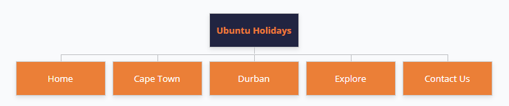
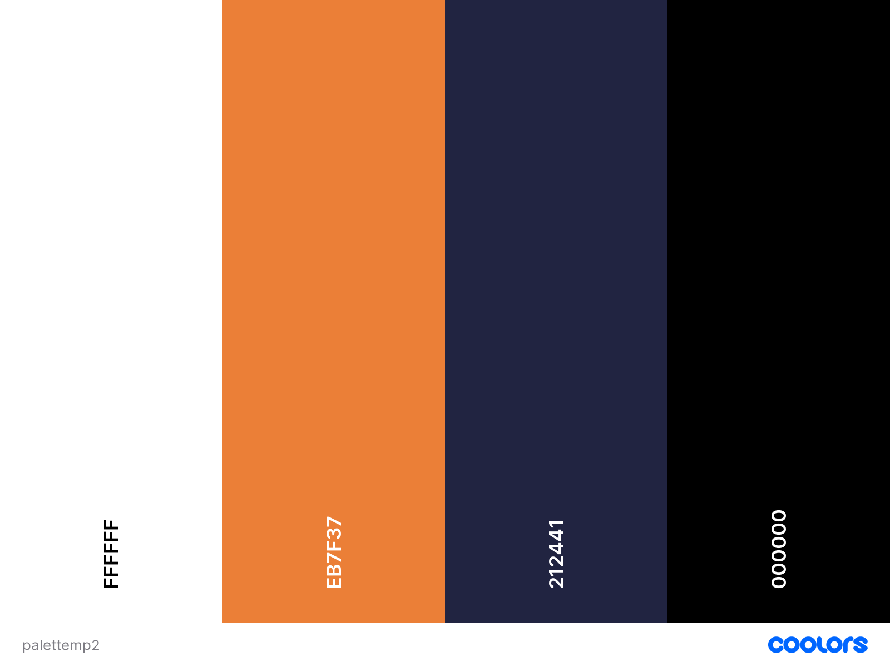
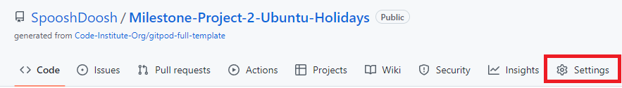
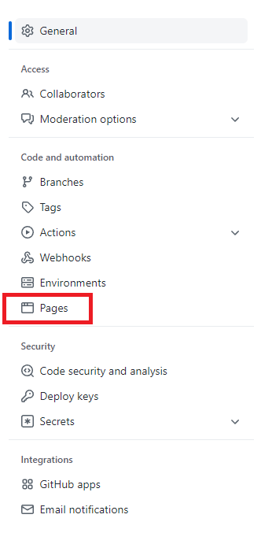

# Ubuntu Holidays
# Milestone Project 2 - Kelvin Nicholson

The purpose of this project was to create a multiple page website for a holiday/tour service provider.

[View live project here](https://spooshdoosh.github.io/Milestone-Project-2-Ubuntu-Holidays/)
--

---

# Table of Contents

* [UX](#ux)
* [TECHNOLOGIES USED](#technologies-used)
* [TESTING](#testing)
* [DEPLOYMENT](#deployment)
* [CREDITS](#credits)
---

# UX
* ## User Stories
  * First Time User Goals:
    * I want to understand the main purpose of the website.
    * I want to be able to easily understand and navigate the website.
    * I want to find an ideal city to visit in South Africa.
    * I want to be able to see what other attractions or accomodations are available.

  * Returning User Goals:
    * I want to find links to social media accounts for easier future contact or to see what updates the company has.
    * I want to be able to contact the company with a general enquiry or to find out how to go about purchasing a package.
    * I want to be able to see package options and find out more info on the cities without having to contact someone.

  * Site Owner Goals:
    * I want the company to be easily found using search engines.
    * I want to bring attention to who we are and what we do.
    * I want site visitors to be able to easily locate the company as well as the contact details easily from the website.
    * I want site visitors to be able to directly contact the company through the website. 

* ## Strategy
  * Is to attract new potential customers to the company, to provide them with information of our services and to provide a point of contact. This is to increase awareness and income.

* ## Scope
  * Provide a clean/smooth UX for users.
  * Provide users with essential information as well as the pre-designed packages we have.
  * Provide users with a way of finding out what else they can do in the locations provided.
  * Provide a clear point of contact.

* ## Structure
  * Existing Features:
    * Four web pages:
      - Home Page - Users can find a description about the company and the destinations we provide holidays to.
      - Cape Town Page - Users can find information about Cape Town, the package options for Cape Town, a map to browse through other attractions / accomodations, and local current weather.
      - Durban Page - Users can find information about Durban, the package options for Durban, a map to browse through other attractions / accomodations, and local current weather.
      - Contact Us Page - Users can contact the company through the contact form or find other points of contact.
    * Users can find all social media links and contact information within the footer of every page. Social media links open in new tabs.
    * Users will receive a 404 Page if they attempt to direct to a page which does not exist.
    * Navigation: 
      * Users can land on any page of the website and find what they need within 3 clicks.
      * Navigation bar is available on every page and has links to all pages.
      * Home page has buttons linking to Cape Town page and Durban page.
      * Cape Town page has a button on each package that will take user to the contact form.
      * Durban page has a button on each package that will take user to the contact form.
      * The Send button on the contact form will submit the form and confirm to the user that the form has been submitted succesfully.
      * User is redirected to Home Page when clicking on the logo.

  * Future Features:
    * Add the ability to view flights to the destination so that users can select a particular flight or route.
    * Add live web chat function to prevent waiting times for responses from form submissions.

* ## Skeleton
  * Wireframes:
    - Mobile: [Home]() | [Cape Town]() | [Durban]() | [Contact Us]() 
    - Tablet: [Home]() | [Cape Town]() | [Durban]() | [Contact Us]()
    - Desktop: [Home]() | [Cape Town]() | [Durban]() | [Contact Us]()

  * Sitemap: 
    * All pages navigate to eachother through the use of buttons or the navigation bar.

    

  * 404 page:
    * User will be redirected to a 404 error page when attempting to access a page that no longer exists or is unavailable. This is the [404 page](404.html).
    

* ## Surface 
  * Colour Scheme:

    

    * The colours for this project were taken from the background of the hero image on the home page.

    * Princeton Orange (EB7F37)

    * Space Cadet (212441)

    * Black (000000) and white (FFFFFF) were used for text to increase contrast between text and backgrounds.

  * Typography:
    * Two fonts were used throughout this website.
      * Great Vibes was used for the logo and navigation bar and all headings.
      * Lato was used everywhere else throughout the website.

  * Imagery:
    * All images throughout the website are images of Cape Town and Durban. Images on the Cape Town and Durban pages are images of each city, as well as the videos on these pages.

---

# Technologies Used
* ## Languages
  * [HTML5](https://en.wikipedia.org/wiki/HTML5) - Used to structure the website.
  * [CSS3](https://en.wikipedia.org/wiki/CSS) - Used to style the content of the website.
  * [JS](https://en.wikipedia.org/wiki/JavaScript) - Used to create interactivity.

* ## Frameworks, Libraries & Programs
  * [Bootstrap](https://getbootstrap.com/) - Used to make the website responsive, for cards listing the cities and packages and for the design of the navigation bar / hamburger menu.
  * [Font Awesome](https://fontawesome.com/) - Used for the icons throughout the website.
  * [EmailJS](https://www.emailjs.com/) - Used for form submission to send an email.
  * [Google Fonts](https://fonts.google.com/) - Used to import the font-families used throughout the website: Great Vibes and Lato.
  * [Git](https://git-scm.com/) - Used for version control.
  * [GitHub](https://github.com/) - Used to create and host the repository for the website.
  * [Gitpod](https://gitpod.io/) - Integrated Development Environment used to develop the website.
  * [Balsamiq](https://balsamiq.com/) - Used for wireframing of the website.
  * [Coolors](https://coolors.co/) - Used to assemble an appropriate colour palette.
  * [Ezgif](https://ezgif.com/) - Used to convert images to WEBP format and compress images.
  * [Gloo Maps](https://www.gloomaps.com/) - Used to create sitemap.

---

# Testing
* Please see [TESTING.md]().

---

# Deployment
This project was deployed to GitHub pages. This project made use of the Code Institute template which can be found [here](https://github.com/Code-Institute-Org/gitpod-full-template).

## GitHub Pages
1. Log in to GitHub and locate this project's [repository](https://github.com/SpooshDoosh/Milestone-Project-2-Ubuntu-Holidays).
2. Select the "Settings" tab on the repository navigation bar.

3. Select the "Pages" tab on the left hand side menu.

4. Under "Source", select the dropdown labelled "None" and change it to "Main". Select "Save".

5. The page will now refresh automatically and provide a link to the published site.

## Local Deployment
1. Log in to GitHub and locate this project's [repository](https://github.com/SpooshDoosh/Milestone-Project-2-Ubuntu-Holidays).

2. Select the "Code" dropdown and copy the link provided.

3. You can now paste this link into your IDE terminal.

---

# Credits
* [Pexels](https://www.pexels.com/) - All images throughout the website were sourced from Pexels.
* [Multi Device Website Mockup Generator](https://techsini.com/multi-mockup/) - Used to create the mockup at the top of the README.md file.
* [Bootstrap](https://getbootstrap.com/) - Used for navbar, cards, grid system and for making the project responsive.