# Testing

# Browser Compatibility
---
This website has been tested and operates as expected on Chrome, Microsoft Edge, Safari, Firefox and Opera browsers.

The website has been tested using Chrome Devloper Tools for it's responsiveness on various device viewports.

It responds as intended on the following devices:

I personally tested the website on my iPad 6 and iPhone 12 Pro Max.

# User Stories Testing

* First Time User
    * I want to understand the main purpose of the website.
        * On the homepage there is a brief description of who Ubuntu Holidays are and what they do / offer.

        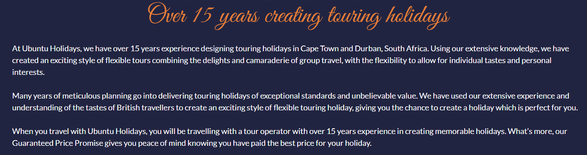

    * I want to be able to easily understand and navigate the website.
        * There is a navigation bar along the top of every page. Active pages are coloured to remind the user of which page they're on. Clicking on the logo will return the user to the homepage. There are buttons throughout the website with a clear description of their purpose.

        

        

    * I want to find an ideal city to visit in South Africa.
        * On the homepage there are two cards, each explaining the two different cities Ubuntu Holidays provides holidays to. Each card contains buttons to the map or to the respective pages for each city.

        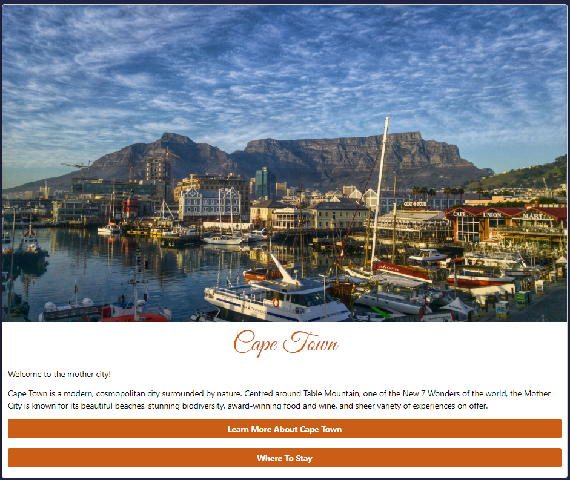

        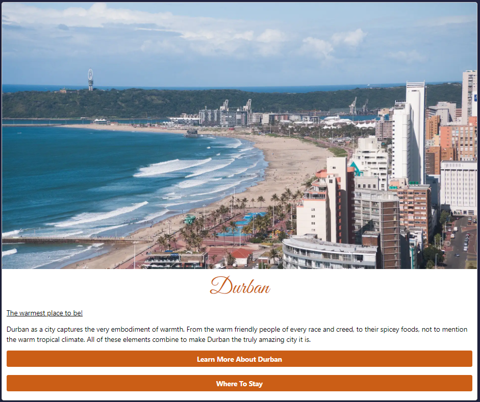

     * I want to be able to see what other attractions or accomodations are available.
        * There are custom markers on the map set to the suggested accommodation, restaurants and attractions. All other pre-existing google maps markers are still available upon zooming in. On larger screen devices there is a legend available explaining the custom markers icons.

        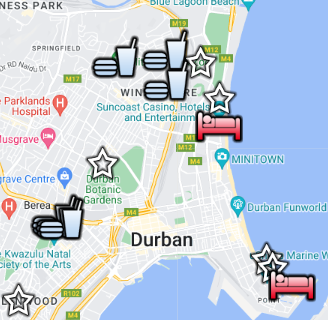

        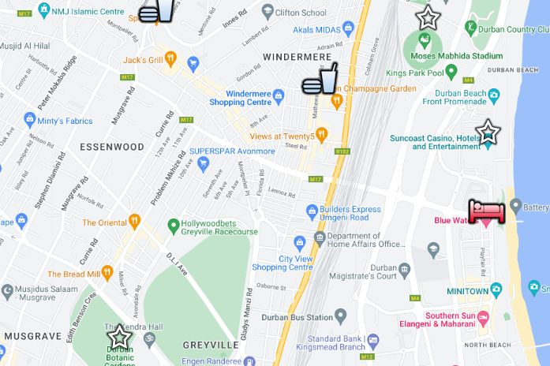

        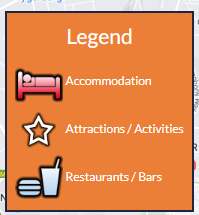

* Returning User
    * I want to find links to social media accounts for easier future contact or to see what updates the company has.
        * Social media links and the ability to sign up to the newsletter are provided at the footer of every page. Links open in new tabs. 

        

        

        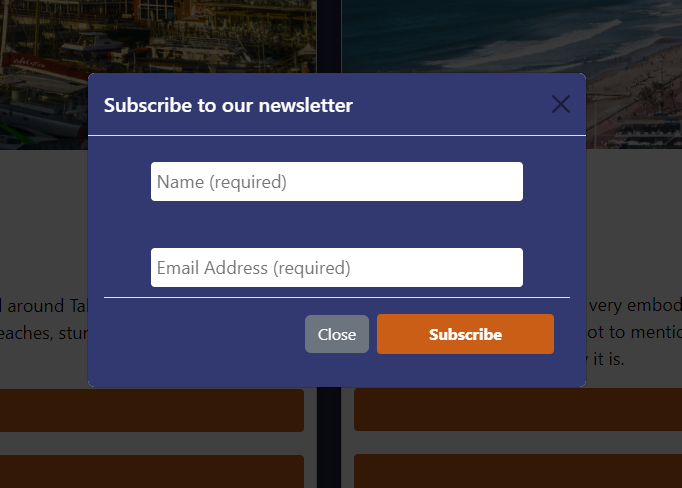

    * I want to be able to contact the company with a general enquiry or to find out how to go about purchasing a package.
        * Contact information can be found at the footer of every page. A contact form is provided on the Contact Us page.

        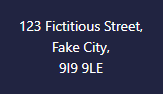

        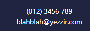

        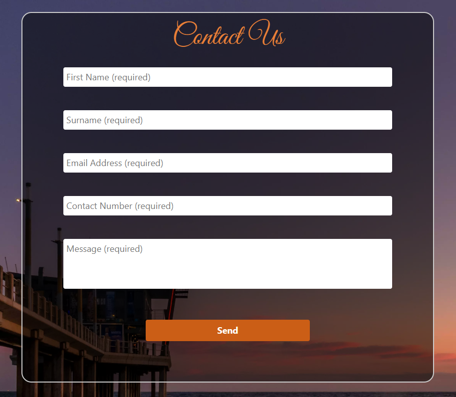

    * I want to be able to see package options and find out more info on the cities without having to contact someone.
        * The Cape Town and Durban pages both have two package idea options.

        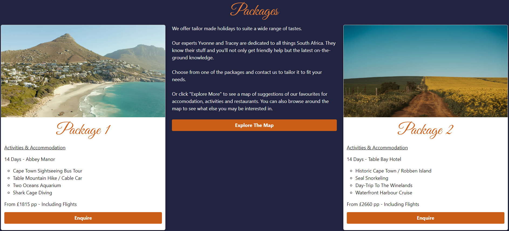

        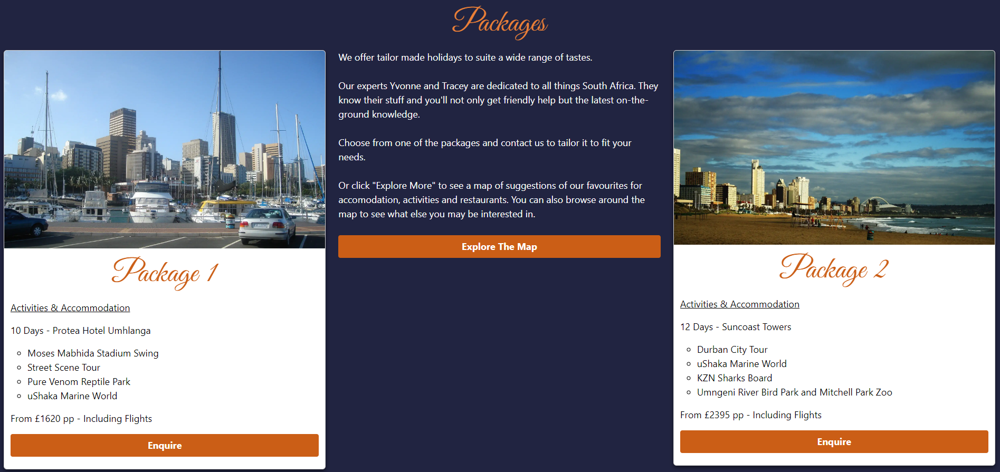

* Site Owner
    * I want the company to be easily found using search engines.
        * Each webpage has been run through lighthouse which produces a score for Search Engine Optimization. These checks ensure that the page is optimized for search engine results ranking.

        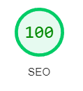

    * I want to bring attention the who we are and what we do.
        * On the homepage there is a brief description of who Ubuntu Holidays are and what they do / offer.

        

    * I want site visitors to the site to be able to easily locate the company as well as the contact details easily from the website.
        * Contact information can be found at the footer of every page. A contact form is provided on the Contact Us page.

        

        

        

    * I want site visitors to be able to directly contact the company through the website.
        * There is a contact form on the Contact Us Page.

        

---

# Code Validation

## HTML

## CSS

---

# Lighthouse

## Desktop Results

## Mobile Results

---

# Color Contrast Accessibility Validation

---

# Debugging

## Resolved

## Unresolved